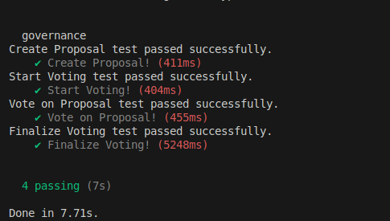

# 🏛️ Solana Governance Program

A decentralized governance system built on Solana blockchain that enables transparent, secure, and efficient proposal voting mechanisms.

## ✨ Features

- **Proposal Creation**: Users can create governance proposals with customizable parameters
- **Voting System**: Secure voting mechanism with time-bound periods
- **Status Tracking**: Real-time proposal status updates (Draft → Voting → Passed/Failed)
- **Anti-Double Voting**: Built-in protection against duplicate votes
- **Time-Based Finalization**: Automatic proposal finalization after voting period

## 🏗️ Architecture

### Smart Contract Components

- **Proposal Management**: Create and manage governance proposals
- **Voting Logic**: Handle secure vote casting and counting
- **State Management**: Track proposal states and voting records
- **Security Controls**: Authorization and validation mechanisms

### Program Instructions

| Instruction | Description |
|-------------|-------------|
| `create_proposal` | Create a new governance proposal |
| `start_voting` | Initiate the voting period for a proposal |
| `vote` | Cast a vote on an active proposal |
| `finalize_voting` | Conclude voting and determine final status |

## 🚀 Getting Started

### Prerequisites

- Rust 1.70+
- Solana CLI 2.2.17+
- Anchor Framework 0.31+
- Node.js 18+

### Installation

1. **Clone the repository**
   ```bash
   git clone github.com/Shradhesh71
   cd governance
   ```

2. **Install dependencies**
   ```bash
   npm install
   ```

3. **Build the program**
   ```bash
   anchor build
   ```

4. **Run tests**
   ```bash
   anchor test
   ```

## 🧪 Test Results

All test cases have been successfully implemented and verified:



✅ **Create Proposal** - Proposal creation with validation  
✅ **Start Voting** - Voting period initialization  
✅ **Vote on Proposal** - Secure vote casting mechanism  
✅ **Finalize Voting** - Proposal status determination  

## 📁 Project Structure

```
governance/
├── programs/
│   └── governance/
│       └── src/
│           ├── lib.rs              # Main program entry
│           ├── state.rs            # Data structures
│           ├── error.rs            # Custom error types
│           └── instructions/       # Program instructions
│               ├── create_proposal.rs
│               ├── start_voting.rs
│               ├── vote.rs
│               └── finalize_voting.rs
├── tests/
│   └── governance.ts               # Test suite
├── app/
│   └── public/
│       └── image.png               # Test verification image
└── README.md
```

## 🔐 Security Features

- **PDA-based Account Security**: Program Derived Addresses for secure account management
- **Authorization Controls**: Creator-only operations for sensitive functions
- **Time-based Validation**: Voting period enforcement
- **Double-voting Prevention**: Unique voter record tracking
- **Input Validation**: Comprehensive parameter checking

## 🛠️ Development

### Running Tests

```bash
# Run all tests
anchor test

# Run with logs
anchor test --logs

# Run specific test
anchor test --grep "Create Proposal"
```

### Local Development

```bash
# Start local validator
solana-test-validator

# Deploy to local cluster
anchor deploy

# Run tests against local cluster
anchor test --skip-local-validator
```

## 📊 Program Accounts

### Proposal Account
```rust
pub struct Proposal {
    pub id: u64,
    pub title: [u8; 32],
    pub description: [u8; 256],
    pub votes_needed_to_pass: u64,
    pub voting_start: i64,
    pub voting_period: i64,
    pub creator: Pubkey,
    pub proposal_status: ProposalStatus,
    pub voting_count: u64,
    pub bump: u8,
}
```

### Vote Record Account
```rust
pub struct VoteRecord {
    pub voter: Pubkey,
    pub proposal: Pubkey,
    pub voted: bool,
    pub bump: u8,
}
```

## 🤝 Contributing

1. Fork the repository
2. Create a feature branch (`git checkout -b feature/amazing-feature`)
3. Commit your changes (`git commit -m 'Add amazing feature'`)
4. Push to the branch (`git push origin feature/amazing-feature`)
5. Open a Pull Request

---

**Built with ❤️ on Solana**